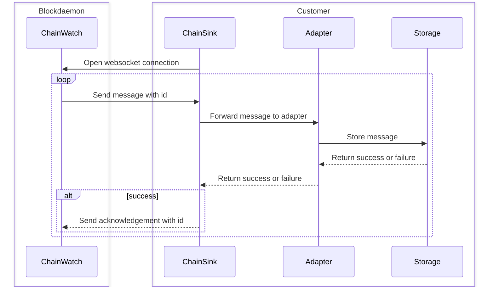
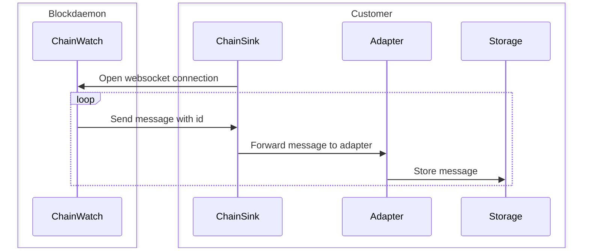

# Chain sink architecture

Chain sink leverages the Blockdaemon Chain Watch API to consume events from the blockchain. Chain sink supports both acknowledgement mode and no acknowledgement mode.

## Acknowledgement mode

In acknowledgement mode, chain sink will send an acknowledgement message for each message received from the Chain Watch API. The Chain Watch API will only send the next message after the acknowledgement message is received. This mode is more reliable, but slower than no acknowledgement mode.

## No acknowledgement mode

In no acknowledgement mode, chain sink will not send any acknowledgement messages to the Chain Watch API. The Chain Watch API will send the next message immediately after the previous message is received. This mode will achieve the highest throughput, but is not recommended when data integrity is important. Failed messages are lost.

